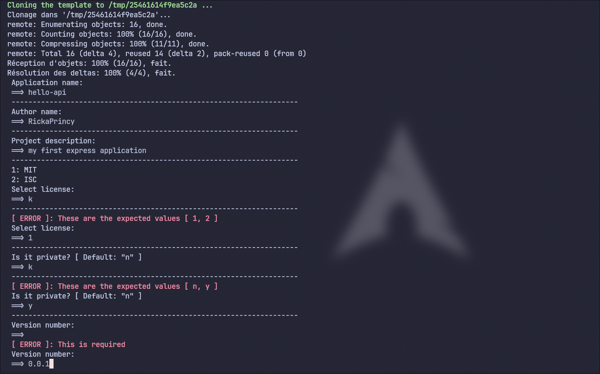
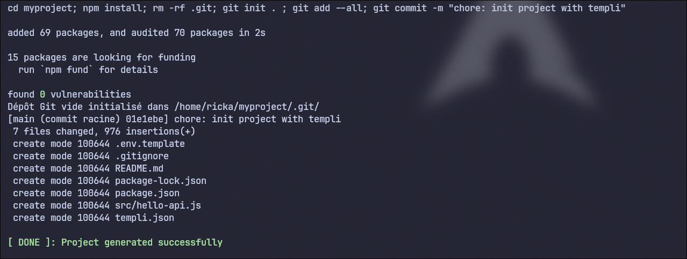
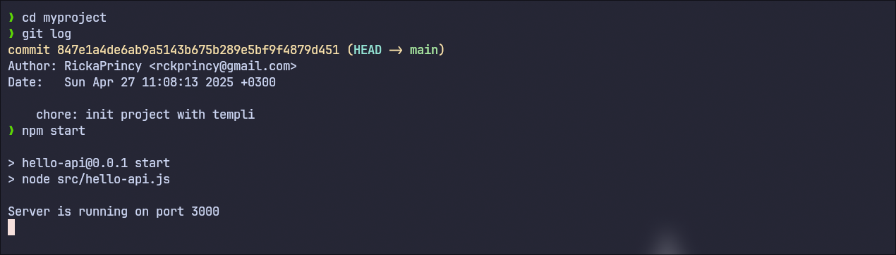

# Example Boilerplate for Templi

1. **Install Templi**  
Before using this boilerplate, make sure you have [Templi](https://github.com/RickaPrincy/Templi) installed.

2. **Generate the Project**  
Run the following command to generate the project:

```bash
templi generate -t https://github.com/RickaPrincy/templi-express-js.git -o ~/myproject
```

This will create a folder called `myproject` (or any custom name you choose) in your home directory (~). The `npm install` command will automatically run after the project is generated.

3. **Navigate to the Project Directory and Run the Project**

After the project is generated and dependencies are installed, navigate to the project folder and start the Express.js application with:

```bash
cd ~/myproject
npm start
```

Replace `~/myproject` with your custom folder name or location if you chose a different one. The application should now be running.

# Example of Templi Output






# More Examples
You can find more examples [here](https://github.com/RickaPrincy/templi-templates)